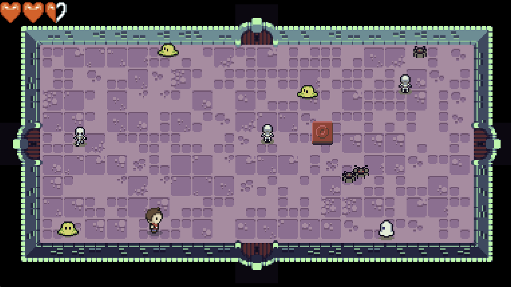
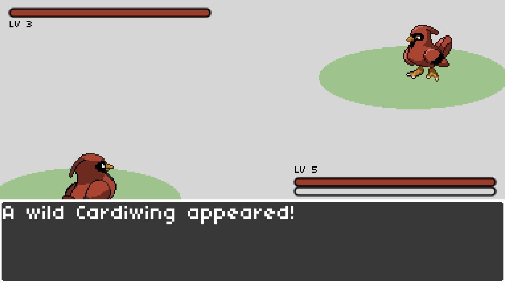
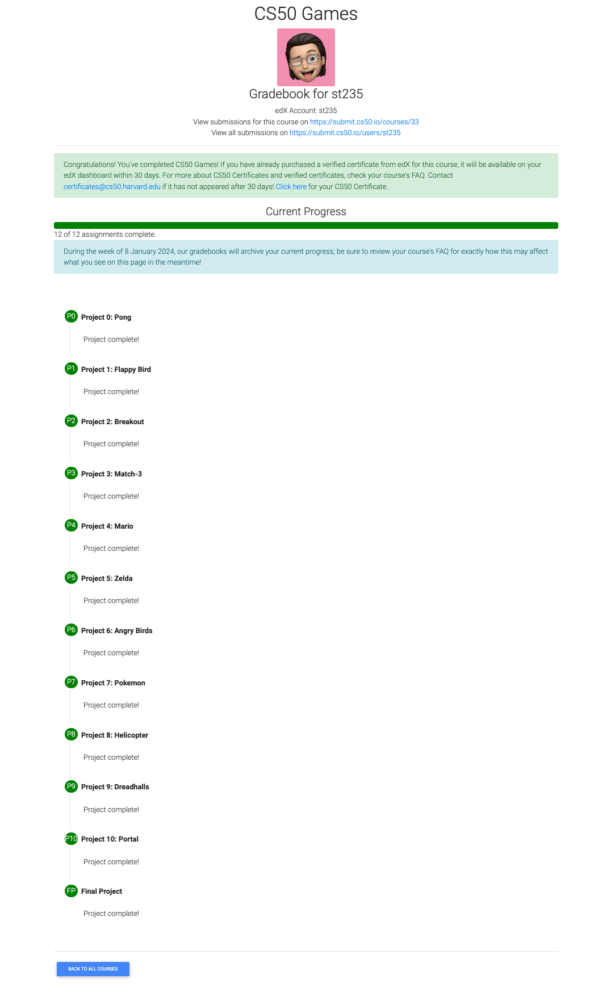

# CS50G Assignments

This repository includes my implementations of the homework assignments from the Harvard CS50G class I took recently.

You can find demo of the projects I implemented [on Youtube](https://youtube.com/playlist?list=PLucKuGqiOAE8lcp4X8El6I5XHNlzYsyyK&si=TVqvDUp74LubgLbI).

## Implemented Projects

| Screenshot | Title | Week | Description |
| ----- | ----- | ----- | ----- |
|  | Pong | Week 0 | |
|  | Flappy Bird | Week 1 | |
|  | Breakout | Week 2 | |
|  | Match | Week 3 | |
|  | Super Mario Bros. | Week 4 | |
|  | Zelda | Week 5 | |
|  | Pokemon | Week 6 | |
|  | Angry Birds | Week 7 | |
|  | Helicopter | Week 8 | |
|  | Dreadhalls | Week 9 | |
|  | Portal | Week 10 | |
|  | Type Racer | Week 11 | |

## Course

### General Information

🎓 Course: CS50's Introduction to Game Development (_aka CS50G_)

🏫 University: Harvard

The course contains 12 graded assigments.

[Web Page](https://cs50.harvard.edu/games/2018/)

[Youtube Lectures Playlist](https://youtube.com/playlist?list=PLhQjrBD2T383Vx9-4vJYFsJbvZ_D17Qzh&si=LGpKB43PcM2cBcFM)

### My Progress

I took the corse from the end of **April 2024** up to **27 May 2024** and received my certificate on **11 June 2024**.

My Gradebook

My Certificate

