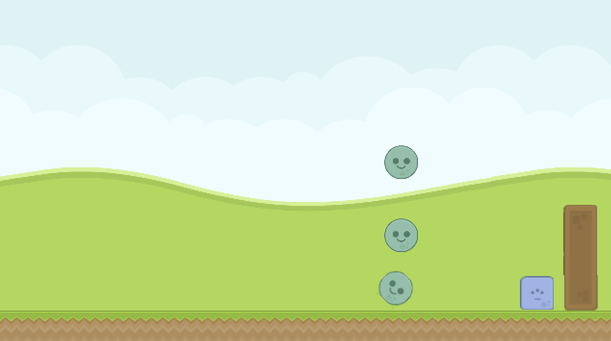

# CS50G Assignments

I recently took the Harvard CS50G class and worked on some cool homework assignments. Since Harvard discontinued the course, I thought it might be helpful to share my work here for anyone still interested in watching the lectures. Enjoy!

You can check out demos of the projects I made [on Youtube](https://youtube.com/playlist?list=PLucKuGqiOAE8lcp4X8El6I5XHNlzYsyyK&si=TVqvDUp74LubgLbI).

## Implemented Projects

| Screenshot | Title | Week | Description |
| ----- | ----- | ----- | ----- |
|  | Pong | Week 0 | Pong is a simple 2 player game in which one player has a paddle on the left side of the screen, the other player has a paddle on the right side of the screen, and the first player to score 10 times on their opponent wins. |
|  | Flappy Bird | Week 1 | Flappy Bird is a simple yet addictive mobile game where players navigate a bird through a series of pipes by tapping the screen to keep it aloft, aiming for the highest possible score. |
|  | Breakout | Week 2 | Breakout is a classic arcade game where players control a paddle to bounce a ball and break a series of bricks, aiming to clear the screen without letting the ball fall. |
|  | Match | Week 3 | Match is a puzzle game where players swap adjacent tiles to create lines of three or more identical pieces. |
|  | Super Mario Bros. | Week 4 | Super Mario Bros. is a legendary platformer game where players control the character as he runs and jumps through levels filled with obstacles and enemies. |
|  | Zelda | Week 5 | Zelda is an action-adventure game where players guide the hero through a sprawling world filled with dungeons, puzzles, and enemies. |
|  | Pokémon | Week 6 | Pokémon is a role-playing game where players, known as trainers, capture, train, and battle creatures called Pokémon to become the champion. |
|  | Angry Birds | Week 7 | Angry Birds is a physics-based puzzle game where players launch birds with a slingshot to destroy structures and defeat the green pigs that have stolen their eggs. |
|  | Helicopter | Week 8 | A game similar to _Flappy Bird_ though in 3D. |
|  | Dreadhalls | Week 9 | Dreadhalls is a first-person virtual reality horror game where players navigate a dark, labyrinthine dungeon, solving puzzles to find their way to safety. |
|  | Portal | Week 10 | Portal is a first-person puzzle-platformer where players use a portal gun to create linked portals for navigating through complex environments. |
|  | Type Racer | Week 11 | Type Racer is a racing simulator with a twist: in this game you move your car with your typing skill. |

To learn more, take a look at the source code in the repo.

## Course

### General Information

🎓 Course: _CS50's Introduction to Game Development_ (_aka CS50G_)

🏫 University: _Harvard_

The course contains _12 graded assigments_.

The lectures are available on [Youtube](https://youtube.com/playlist?list=PLhQjrBD2T383Vx9-4vJYFsJbvZ_D17Qzh&si=LGpKB43PcM2cBcFM). For more info, check out the official [web page](https://cs50.harvard.edu/games/2018/).

### My Progress

I took the corse from the end of **April 2024** up to **27 May 2024**, and received my certificate on **11 June 2024**.
Here's a look at the accomplishments I've achieved:

#### My Gradebook

I completed all 12 assignments, including the final project: my own game, [`Type Racer`](./type-racer/).

#### My Certificate

After wrapping up the course, I finally snagged my certificate (just in the nick of time, phew 🎉). You can verify the certificate by their id: [3f550074-29ae-4e1d-8a29-a0085d29bf97](https://cs50.harvard.edu/certificates/3f550074-29ae-4e1d-8a29-a0085d29bf97).

