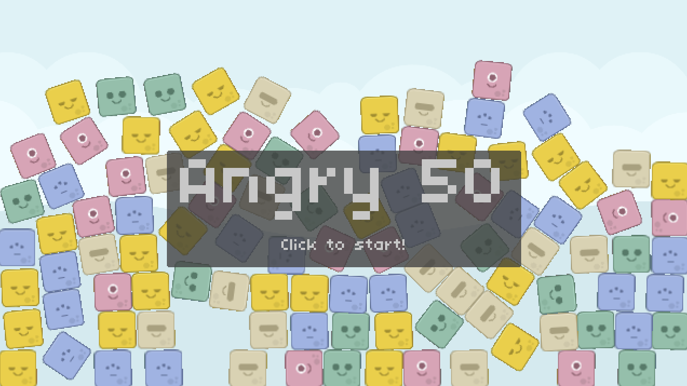
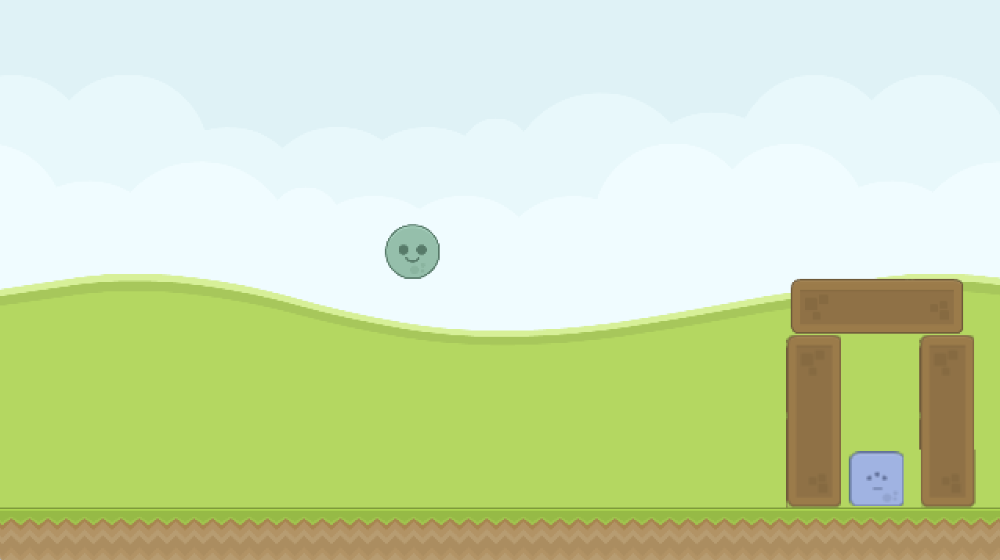

# Angry Birds

| Title Screen | Gameplay |
| ----- | ----- |
|  |  |

### Task

- Implement it such that when the player presses the space bar after they’ve launched an Alien (and it hasn’t hit anything yet), split the Alien into three Aliens that all behave just like the base Alien. The code for actually launching the Alien exists in AlienLaunchMarker, and we could naively implement most, if not all, of this code in the same class, since the Alien in question we want to split off is a field of this class. However, because we want to only allow splitting before we’ve hit anything, we need a flag that will get triggered whenever this Alien collides with anything else, so we’ll likely want the logic for this in the Level itself here, since that is where we pass in the collision callbacks via World:setCallbacks(). The center Alien doesn’t really need to be modified for the splitting process; really, all we need to do is spawn two new Aliens at the right angle and velocity so that it appears we’ve turned the single Alien into three, one above and one below. For this, you’ll need to take linear velocity into consideration. Additionally, be aware that the Alien we want to launch has the userData of the string “Player”, as opposed to the Alien we want to kill, which has just the userData of “Alien”. Lastly, be sure that the launch marker doesn’t reset until all of the Aliens we fling have slowed to nearly being still, not just the one Alien we normally check. In all, you should have all of the pieces at this point you need in order to make this happen; best of luck!
