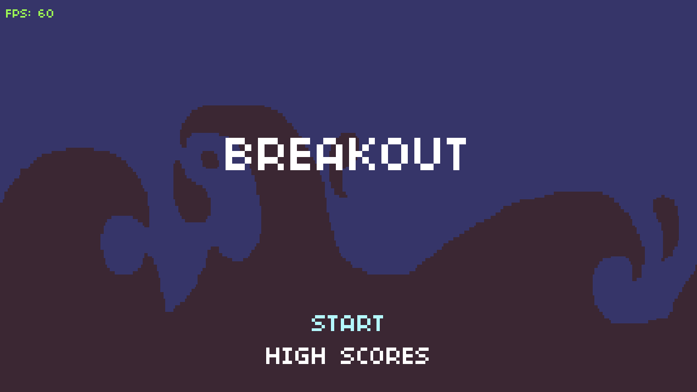
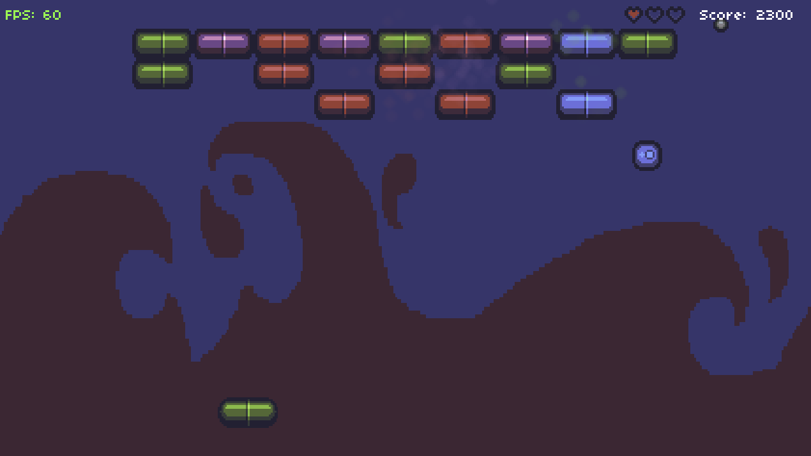

# Breakout

| Title Screen | Gameplay |
| ----- | ----- |
|  |  |

### Task

- Add a Powerup class to the game that spawns a powerup (images located at the bottom of the sprite sheet in the distribution code). This Powerup should spawn randomly, be it on a timer or when the Ball hits a Block enough times, and gradually descend toward the player. Once collided with the Paddle, two more Balls should spawn and behave identically to the original, including all collision and scoring points for the player. Once the player wins and proceeds to the VictoryState for their current level, the Balls should reset so that there is only one active again.
- Grow and shrink the Paddle such that it’s no longer just one fixed size forever. In particular, the Paddle should shrink if the player loses a heart (but no smaller of course than the smallest paddle size) and should grow if the player exceeds a certain amount of score (but no larger than the largest Paddle). This may not make the game completely balanced once the Paddle is sufficiently large, but it will be a great way to get comfortable interacting with Quads and all of the tables we have allocated for them in main.lua!
- Add a locked Brick (located in the sprite sheet) to the level spawning, as well as a key powerup (also in the sprite sheet). The locked Brick should not be breakable by the ball normally, unless they of course have the key Powerup! The key Powerup should spawn randomly just like the Ball Powerup and descend toward the bottom of the screen just the same, where the Paddle has the chance to collide with it and pick it up. You’ll need to take a closer look at the LevelMaker class to see how we could implement the locked Brick into the level generation. Not every level needs to have locked Bricks; just include them occasionally! Perhaps make them worth a lot more points as well in order to compel their design. Note that this feature will require changes to several parts of the code, including even splitting up the sprite sheet into Bricks!

### Implementation details

- Multiball Powerup
    - Spawns with 20% chance when the ball hits a block
    - Spawns only if there is a single ball and no other multiball powers are currently in play
    - Maximum 3 balls can be at the same time in play
- Unlock Powerup
    - Spawns every 5 seconds to prevent soft-lock situations when there is the only locked block in play
    - Collected powerups are displayed in the right top corner
    - Unlock powerups are saved within the level but reset when new level begins
- Locked block
    - Locks a regular block
    - If hit with the unlock powerup replaced with a regular block
- Paddle demotion and promotion
    - 4 paddle sizes available
    - Paddle shrinks when there are no balls in play (at the same time the player loses one hearth)
    - Paddle extends every 1500 points

### Misc

- [Pixel Art Keys](https://dustdfg.itch.io/pixel-art-keys). License CC0.