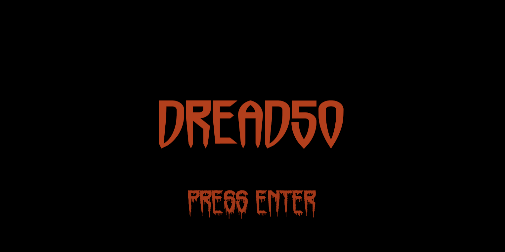

# Deadhalls

| Title Screen | Gameplay |
| ----- | ----- |
|  |  |

### Task

- Spawn holes in the floor of the maze that the player can fall through (but not too many; just three or four per maze is probably sufficient, depending on maze size). This should be very easy and only a few lines of code. The LevelGenerator script will be the place to look here; we aren’t keeping track of floors or ceilings in the actual maze data being generated, so best to take a look at where the blocks are being insantiated (using the comments to help find!).
- When the player falls through any holes, transition to a “Game Over” screen similar to the Title Screen, implemented as a separate scene. When the player presses “Enter” in the “Game Over” scene, they should be brought back to the title. Recall which part of a Unity GameObject maintains control over its position, rotation, and scale? This will be the key to testing for a game over; identify which axis in Unity is up and down in our game world, and then simply check whether our character controller has gone below some given amount (lower than the ceiling block, presumably). Another fairly easy piece to put together, though you should probably create a MonoBehaviour for this one (something like DespawnOnHeight)! The “Game Over” scene that you should transition to can effectively be a copy of the Title scene, just with different wording for the Text labels. Do note that transitioning from the Play to the Game Over and then to the Title will result in the Play scene’s music overlapping with the Title scene’s music, since the Play scene’s music is set to never destroy on load; therefore, how can we go about destroying the audio source object (named WhisperSource) at the right time to avoid the overlap?
- Add a Text label to the Play scene that keeps track of which maze they’re in, incrementing each time they progress to the next maze. This can be implemented as a static variable, but it should be reset to 0 if they get a Game Over. This one should be fairly easy and can be accomplished using static variables; recall that they don’t reset on scene reload. Where might be a good place to store it?

### Implementation details

1. Holes
    - There are 5 holes in the entire maze at maximum. The value has been tuned empirically and [is exposed](./Assets/Scripts/LevelGenerator.cs#L38) to the Unity Inspector.
    - The chance of generating a hole is 5% and is defined in [`LevelGenerator`](./Assets/Scripts/LevelGenerator.cs#L38).
2. Game Over
    - There is a script called [`FallingBehaviour`](./Assets/Scripts/FallingBehaviour.cs) that controls the behaviour on falling through the hole
    - On fall the screaming sound is played but the ambient (from `WhisperSource`) is still playing, **transitioning the whispering sound** to the `GameOver` scene (wanted to keep the vibe at the `Game Over` screen)
    - The ambient whispering sound is stopped at the `Title` screen via [`AmbientController`](./Assets/Scripts/AmbientController.cs). Whenever the scene is created and there is a `DontDestroy` instance it got destroyed making the ambient to stop. Whenever user enters `Play` state a `DontDestroy` instance is created.
3. Level
    - Level logic is defined in [`LevelController`](./Assets/Scripts/LevelController.cs)

### Acknowledgements

- Death Sound Effect by [u_r7cny11q7r](https://pixabay.com/users/u_r7cny11q7r-41888232/?utm_source=link-attribution&utm_medium=referral&utm_campaign=music&utm_content=186763) from [Pixabay](https://pixabay.com/sound-effects//?utm_source=link-attribution&utm_medium=referral&utm_campaign=music&utm_content=186763)
