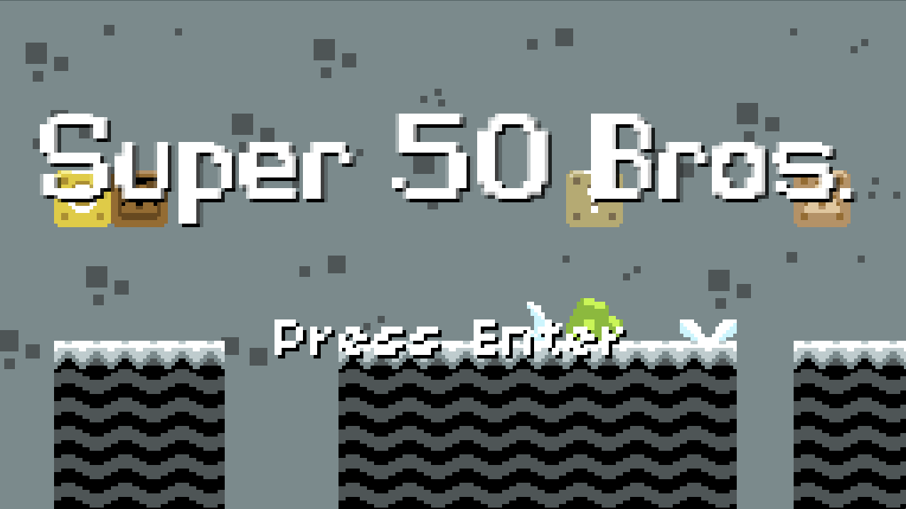

# Mario

| Title Screen | Gameplay |
| ----- | ----- |
|  |  |

## Task

- Program it such that when the player is dropped into the level, they’re always done so above solid ground. Just like we generate the level column by column (as can be seen in LevelMaker.lua), we can check the game’s map column by column and simply ensure that the player isn’t placed above a column that just spawned a chasm by looking at all of the tiles along the Y-axis, going from left to right, until we’ve come across a column where we encounter a solid tile (as by checking whether the id is equal to TILE_ID_GROUND).
- In LevelMaker.lua, generate a random-colored key and lock block (taken from keys_and_locks.png in the graphics folder of the distro). The key should unlock the block when the player collides with it, triggering the block to disappear. This is something you’ll introduce into LevelMaker.generate while it’s actively generating the level; simply maintaining a flag for whether the key and lock have been spawned and placed and randomly choosing to place them down could do (or you could simply do it after the whole rest of the level is generated). The former will likely be easier so you can conditionally do it when you’re not already spawning a block, since otherwise you’ll have to iterate over all of the blocks you’ve already generated throughout the level and compare their positions with that of where you’d potentially like to generate a key or lock. See how the code for spawning gems works (particularly with the onConsume callback) for how you might implement picking up the key, and see the code for spawning blocks and the onCollide function for how you might implement the key blocks!
- Once the lock has disappeared, trigger a goal post to spawn at the end of the level. Goal posts can be found in flags.png; feel free to use whichever one you’d like! Note that the flag and the pole are separated, so you’ll have to spawn a GameObject for each segment of the flag and one for the flag itself. This is code we can likely add to the onCollide function of our lock blocks, once we’ve collided with them and have the key they need to unlock. Just like gems spawn when we collide with some overhead blocks, you’ll simply need to add new GameObjects to the scene that comprise a flag pole. Note that the pole and flag are separate objects, but they should be placed in such a way that makes them look like one unit! (See the scene mockup in full_sheet.png for some inspiration).
- When the player touches this goal post, we should regenerate the level, spawn the player at the beginning of it again (this can all be done via just reloading PlayState), and make it a little longer than it was before. You’ll need to introduce params to the PlayState:enter function that keeps track of the current level and persists the player’s score for this to work properly. The easiest way to do this is to just add an onConsume callback to each flag piece when we instantiate them in the last goal; this onConsume method should then just restart our PlayState, only now we’ll need to ensure we pass in our score and width of our game map so that we can generate a map larger than the one before it. For this, you’ll need to implement a PlayState:enter method accordingly; see prior assignments for plenty of examples on how we can achieve this! And don’t forget to edit the default gStateMachine:change('play') call to take in some default score and level width!

## Implementation details

- The locked block is **always** spawned after the key
