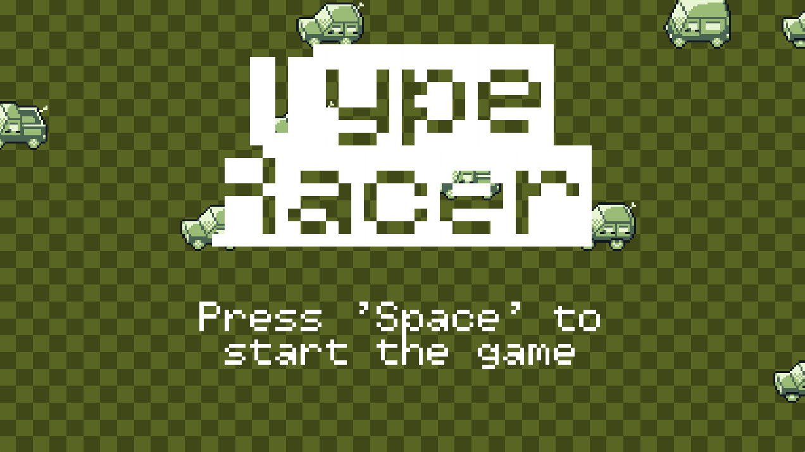
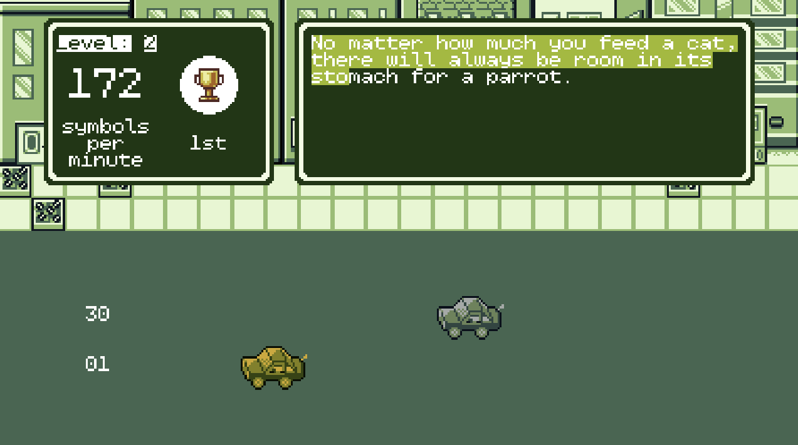

# Type Racer

This is a final project for the **CS50G**!

## Description

| Title Screen | Gameplay |
| ----- | ----- |
|  |  |


`Type Racer` is a racing simulator with a twist. Wow! 

Although instead of classical racing games you move your car with your typing skill. A few boss fights offers enough challenge even to advanced players. Your typing prowess is the key to becoming the champion.

Ready to race? Let's go! 🏁

### Details of game play

1. Offers multiple levels: regular races and boss fights. The end goal is to finish all levels and see the credits. Moreover, you can always earn different trophies along the way!
2. Every level provides their own challenges: stronger opponents or less tolerance to typos. The game restarts from the beginning if the amount of consequtive typos has been exceeded or all opponents finished the race.

## Implementation details

- Your game must be in either LÖVE or Unity.
- Your game must be a cohesive start-to-finish experience for the user; the game should boot up, allow the user to play toward some end goal, and feature a means of quitting the game.
- Your game should have at least three `GameState`s to separate the flow of your game’s user experience, even if it’s as simple as a `StartState`, a `PlayState`, and an `EndState`, though you’re encouraged to implement more as needed to suit a more robust game experience (e.g., a fantasy game with a `MenuState` or even a separate `CombatState`).
- Your game can be most any genre you’d like, though there needs to be a definitive way of winning (or at least scoring indefinitely) and losing the game, be it against the computer or another player. This can take many forms; some loss conditions could be running out of time in a puzzle game, being slain by monsters in an RPG, and so on, while some winning conditions may be defeating a final boss in an RPG, making it to the end of a series of levels in a platformer, and tallying score in a puzzle game until it becomes impossible to do more.
- You are allowed to use libraries and assets in either game development environment, but the bulk of your game’s logic must be handwritten (i.e., putting together an RPG in Unity while using a UI library would be considered valid, assuming the bulk of the game logic is also not implemented in a library, but recycling a near-complete game prototype from Unity’s asset store with slightly changed labels, materials, etc. would not be acceptable).

> The most common cause for failure of the final project is not spending enough effort on this next instruction. Your README.md file should be minimally multiple paragraphs in length, and should provide a relatively comprehensive documentation of what you did and, if applicable, why you did it. Ensure you allocate sufficient time and energy to writing a README.md that you are proud of and that documents your project thoroughly, and that distinguishes this project from others in the course and defends its complexity!

- Your project must be at least as complex as (and distinct from!) the games you’ve implemented in this course, and should really be moreso. Submissions of low complexity may be rejected! You must explain your game in detail and why you believe it to meet the complexity and distinctiveness requirement in a `README.md` file at the root of your project.

## Criteria justification

### Formal criteria

1. Game in LÖVE
2. The game offers a complete experience with a chance to see the credits. There are multiple levels with regular opponents and a few boss fights.
3. There are 11 states: `BeginLevelState`, `CountDownState`, `CreditsState`, `FadeInState`, `FadeOutState`, `GameOverState`, `KOState`, `LeaderboardState`, `PlayState`, `StartState`, `VictoryState`.
4. I am not 100% sure about the game genre. However, I think it is pretty close to a **side-scroller**. The game contains multiple levels (all of them are data driven!) altering between boss fights and regular races.
5. I used the following libraries: `knife`, `class`, and `push`. Moreover, I reused implementations of `Animation`, `StateMachine`, `StateStack`, `BaseState`, and `TileUtil`. Though I extended the functionally of some of these elments and fixed bugs within in (for example, changing `self.looping = def.looping or true` as it is always `true`). All other classes are implemented from scratch.
6. See details below on what was implemented.

### Additional commands

I worked thoroughly on this game and spend a lot of time on some concepts. I tried to implement the game in _Game Boy_-like style and, hopefully, you will enjoy it!

1. Views hierarchy

You can find my `gui` elements under [`gui` folder](./src/gui/). There are 2 main concepts I introduced: `views` and `backgrounds`. _Backgrounds_ are stateless classes that draw plain shapes on the screen. They are highly coupled with _views_. _Views_, on the contrary, are GUI elements that contain state.

Base `View` contains a lot of useful methods and some of them saved me hours of debugging. For example, [`View#setDebug`](./src/gui/view/View.lua#L42) allows to **draw** view boundaries so you can easily locate them at the screen. [`View#setBackground`] can associate any _Background` with a view. Once associated, a _background_ instance draws a shape onto the rear layer of the view.

I implemented the next _background_ and _views_:

- _Backgrounds_:
    - _Circle_: draws a circle with a radius equal to a minimal dimension of the associated `view`.
    - _Rectangle_: draws simple or rounded rectanle.
    - _Panel_: `GameBoy`-like dialog. A simple stack of 3 rectangles creates an illusion of having a modal window with a _frame_.

- _Views_:
    - _View_: base view, draws boundaries if in debug mode, draws backgrounds, and helps with _paddings_ if provided.
    - _Icon_: shows a texture (or a quad from texture) within view's boundaries.
    - _Label_: displays the given text, takes into account different fonts, custom paddings, gravity (_how the text is aligned_), vertical arrangmenet (_top, center, or bottom_) color, and alpha values.
    - _Leaderboard_: a set of rows, organised in a table.
    - _LeaderboardRow_: a single row of a leadbord view. Displays place, driver name, id (_aka license plate_), speed (_symbols per minute_), and time taken to finish the race.
    - _StatsView_: shows speed and current position in a race side-by-side.
    - _TemplateMatcher_: interactive view. Reads text from the default input method and match it with a provided template. Highlights the match in green and errors in red.

2. Animations

There are plenty of relatively-simple `tweening` in the project (for example, `CreditsState`) but I won't discuss them below. I want to cover a few sophisticated animations in the project. All of them are implemented within their states:

- `VictoryState`: uses particles system to create `confetti`-like effect.
- `KOState`: I was inspired by a `Pokemon` game we implemented earlier in the course and decided to implement something similar for boss fights. Boss is slightly tilted to the side over time and then falls into the abbys.
- `GameOverState`: I used `stencelling` to create an old-movie-like effect. I projected some of the screen into the stencil to leave this area transparent.

3. Data Driven approach

I implemented the levels in a way them are really easy to modify.

Levels are located in [`levels_defs.lua`](./src/levels_defs.lua). You can find a level structure below:

```lua
    [leveId] = {
        {
            bossFight: bool,
            allowedTypos: int,
            text: str,
            opponents: array of str,
        },
        ...
    },
    ...
```

- `levelId` is a unique identifier of a level associated with a **table of variations of the same level**
- `bossFight` flag for levels containing boss fight: should have the only opponent and have a slightly different ambient music and closing transitions (like, `KOState`)
- `text` is a template to match
- `opponents` a table of 0 to 4 opponent string **ids** (should match keys in `opponents_defs`)

Opponents (or enemies) are defined in [`opponents_defs.lua`](./src/opponents_defs.lua). The opponent schema is:

```lua
    [opponentId] = {
        name: str,
        driverId: int,
        width: int,
        height: int,
        texture: str,
        frames: array of ints,
        speed: int,
        tint: color (array of ints with 3 elements),
    },
    ...
```

- `opponentId` is a string identified on the opponent that can be used in levels definition
- `name` is a string representation of a driver (the name is displayed in leaderboards)
- `width` and `height` are dimensions of the game object
- `texture` is the name of a texture located in `gTextures`
- `frames` is a quad indexes of quads for the given texture
- `speed` a driver's typing speed in **symbols per minute**
- `tint` is tint that used for drivers' vehicles. **White** for regular `NPCs` (i.e. no color override) and others for `bosses`

4. Game Logic

Game logic (domain logic) itself is quite complicated as well! The most notable abstractions are:

- [`TemplateMatcher`](./src/gui/view/TemplateMatcher.lua) is a GUI element that handles the input and reports the typing speed. Moreover, I implemented [`Queue` API](./src/utils/Queue.lua) (based on a single linked list) for this specific purpose: I was concerned whether someone can type faster then the frames refresh rate (about _1/60_ of a second). So, all symbols received from `love.textinput(t)` are accumulated in an instance of this queue. `love.textinput(t)` handles the input as it report not the keycodes but the real symbols (for instance, with respect to `shift` keys).
- [`Lane`](./src/Lane.lua) is an abstraction for drawing a car on the road. Lane operates with units-indeppendent progress on a scale from _0 to 1_.
- [`Race`](./src/Race.lua) is a table of **lanes**. Moreover, it knows about the progress of a player and can distinct player's vehicle from other vehicles. It also keeps track of time.
- [`Level`] unites _gui_ and _game object_ to provide the game experience.

## Acknowledgements

The game is solely implement by me (`Alex Dadukin`) with help of my sister and wife to test the game and the levels I designed. Moreover, I used free assets and I believe it is important to give proper credit: 

- Sprites
    - [GB Studio Vehicle Asset Pack](https://reakain.itch.io/gb-studio-vehicle-asset-pack)
    - [GameBoy-styled essential outdoor tiles by chuckiecatt](https://chuckiecatt.itch.io/gameboy-styled-essential-outdoor-tiles)
    - [GB Studio Buildings](https://reakain.itch.io/gb-studio-buildings)
    - [Trophies pack](https://vsioneithr.itch.io/trophy-cups-pixel-pack)
    - [Gameboy Background/Pattern Pack](https://2bitcrook.itch.io/gameboy-pattern-pack)
- Font
    - Retro font [Kitchen Sink](https://polyducks.itch.io/kitchen-sink-textmode-font)
- Sounds
    - Race Sound Effect by [Jurij](https://pixabay.com/users/soundreality-31074404/?utm_source=link-attribution&utm_medium=referral&utm_campaign=music&utm_content=151254) from [Pixabay](https://pixabay.com//?utm_source=link-attribution&utm_medium=referral&utm_campaign=music&utm_content=151254)
    - Stationary Sound Effect from [Pixabay](https://pixabay.com/?utm_source=link-attribution&utm_medium=referral&utm_campaign=music&utm_content=90456)
    - Horn Sound Effect from [Pixabay](https://pixabay.com/sound-effects/?utm_source=link-attribution&utm_medium=referral&utm_campaign=music&utm_content=6466)
    - Mechanical Keyboard Typing Sound Effect from [Pixabay](https://pixabay.com/?utm_source=link-attribution&utm_medium=referral&utm_campaign=music&utm_content=102918)
    - Confirm Sound Effect by [UNIVERSFIELD](https://pixabay.com/users/universfield-28281460/?utm_source=link-attribution&utm_medium=referral&utm_campaign=music&utm_content=210334) from [Pixabay](https://pixabay.com//?utm_source=link-attribution&utm_medium=referral&utm_campaign=music&utm_content=210334)
    - "Night Phonk" track by [Artsiom Bialou](https://pixabay.com/users/artiss22-29919399/?utm_source=link-attribution&utm_medium=referral&utm_campaign=music&utm_content=203960) from [Pixabay](https://pixabay.com//?utm_source=link-attribution&utm_medium=referral&utm_campaign=music&utm_content=203960)
    - "World is on fire" track by [Melody Ayres-Griffiths](https://pixabay.com/users/melodyayresgriffiths-27269767/?utm_source=link-attribution&utm_medium=referral&utm_campaign=music&utm_content=184774) from [Pixabay](https://pixabay.com//?utm_source=link-attribution&utm_medium=referral&utm_campaign=music&utm_content=184774)
    - "Racing" track by [Yurii Semchyshyn](https://pixabay.com/users/qubesounds-24397640/?utm_source=link-attribution&utm_medium=referral&utm_campaign=music&utm_content=125862) from [Pixabay](https://pixabay.com/music//?utm_source=link-attribution&utm_medium=referral&utm_campaign=music&utm_content=125862)
    - "Flat (8-bit gaming music)" track by [SoundUniverseStudio](https://pixabay.com/users/sounduniversestudio-43016639/?utm_source=link-attribution&utm_medium=referral&utm_campaign=music&utm_content=211547) from [Pixabay](https://pixabay.com//?utm_source=link-attribution&utm_medium=referral&utm_campaign=music&utm_content=211547)
    - KO Sound Effect from [Pixabay](https://pixabay.com/sound-effects/?utm_source=link-attribution&utm_medium=referral&utm_campaign=music&utm_content=95973)
