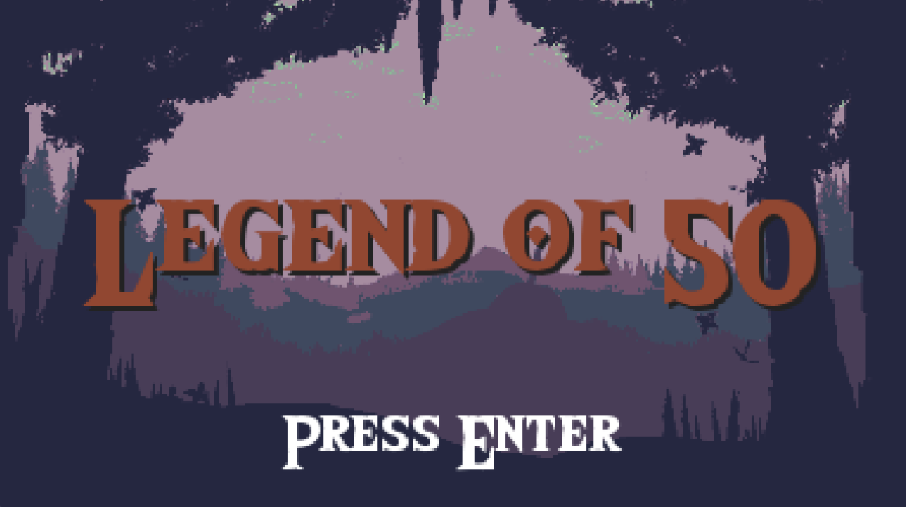
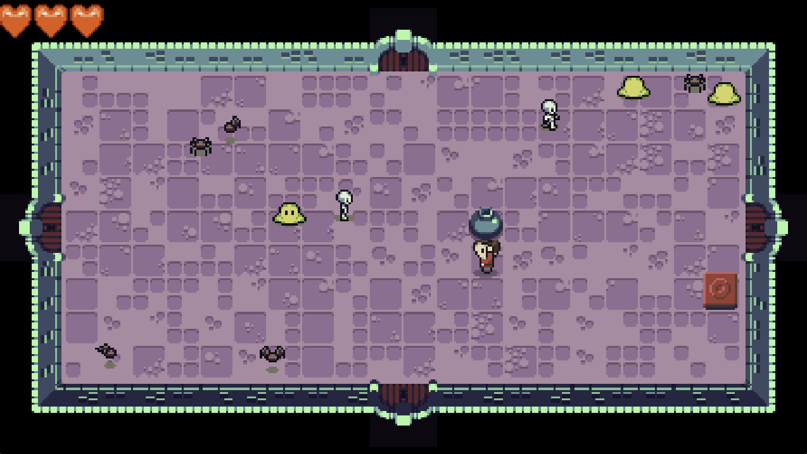

# The legend of Zelda

| Title Screen | Gameplay |
| ----- | ----- |
|  |  |

### Task

- Implement hearts that sometimes drop from vanquished enemies at random, which will heal the player for a full heart when picked up (consumed). Much of this we’ve already done in Super Mario Bros., so feel free to reuse some of the code in there! Recall that all Entities have a health field, including the Player. The Player’s health is measured numerically but represented via hearts; note that he can have half-hearts, which means that each individual heart should be worth 2 points of damage. Therefore, when we want to heal the Player for a full heart, be sure to increment health by 2, but be careful it doesn’t go above the visual cap of 6, lest we appear to have a bug! Defining a GameObject that has an onConsume callback is probably of interest here, which you can refer back to Super Mario Bros. to get a sense of, though feel free to implement however best you see fit!
- Add pots to the game world (from the tile sheet) at random that the player can pick up, at which point their animation will change to reflect them carrying the pot (shown in the character sprite sheets). The player should not be able to swing their sword when in this state. In most of the Zelda titles, the hero is able to lift pots over his head, which he can then walk around with and throw at walls or enemies as he chooses. Implement this same functionality; you’ll need to incorporate pot GameObjects, which should be collidable such that the Player can’t walk through them. When he presses a key in front of them, perhaps enter or return, he should lift the pot above his head with an animation and then transition into a state where he walks around with the pot above his head. This will entail not only adding some new states for the Player but also ensuring a link exists (pun intended) between a pot and the character such that the pot always tracks the player’s position so it can be rendered above his head. Be sure the Player cannot swing his sword while in this state, as his hands are full!
- When carrying a pot, the player should be able to throw the pot. When thrown, the pot will travel in a straight line based on where the player is looking. When it collides with a wall, travels more than four tiles, or collides with an enemy, it should disappear. When it collides with an enemy, it should do 1 point of damage to that enemy as well. Carrying the pot is one thing; the next step would be to be able to use the pot as a weapon! Allow the Player to throw the pot, effectively turning it into a projectile, and ensure it travels in a straight line depending on where the Player is facing when they throw it. When it collides with a wall, an enemy, or if it travels farther than four tiles in that direction, the pot should shatter, disappearing (although an actual shatter animation is optional). If it collides with an enemy, ensure the pot does 1 point of damage. There are many ways you can achieve this; think about how you can extend GameObject to fit this use case, perhaps adding a projectile field and therefore a dx or dy to the GameObject to allow it to have traveling functionality. Perhaps include a :fire method as part of GameObject that will trigger this behavior as by passing in said dx and dy instead. The choice is yours, but GameObject is flexible enough to make it work!

### Implementation details

- The heart generates with 15% chance
- Pot has one of 6 random skins

